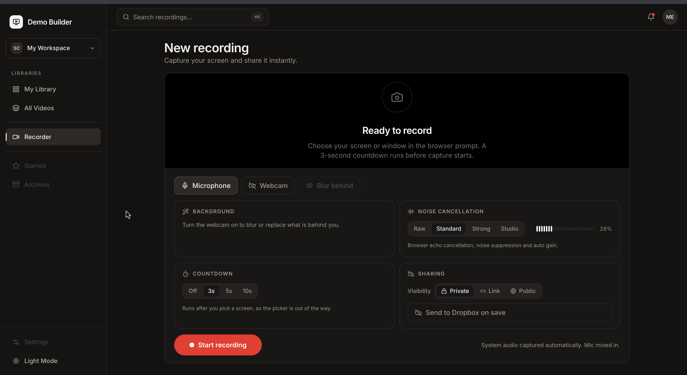

# Demo Builder

Record your screen and webcam in the browser, review the take, and hand someone
a link to the product you are building — one click, no export step.



## The problem

Showing work costs more than doing it. Recording a two-minute walkthrough means
a desktop capture app, an export, a file too big to email, and an upload to
somewhere the viewer can actually open. Every step is a place to give up, and
the hosted tools that remove those steps want a per-seat subscription and your
screen recordings on their servers.

The bet here is that the browser is already a complete recording studio. Screen
capture, camera segmentation, audio processing and encoding all have real APIs
now, so the only thing a server is genuinely needed for is holding the file and
handing out a link. That makes the backend small enough to self-host, and means
the recording never touches infrastructure you do not control unless you connect
Dropbox on purpose.

## System design

The browser does the media work; the server is a thin store-and-stream tier.

```
getDisplayMedia + getUserMedia
  -> canvas composite (screen + webcam bubble, MediaPipe segmentation)
  -> Web Audio mic chain (mixed with system audio)
  -> MediaRecorder -> single WebM blob
  -> XHR multipart upload -> Express 5 + multer -> file on disk
                                                -> metadata row in Postgres
  -> playback via HTTP range requests
  -> optional mirror to Dropbox -> shared link
```

Capture is client-side by design: compositing, segmentation and audio processing
all run on-device, so the server never transcodes and scales with disk and
bandwidth rather than CPU. The recording canvas is driven by a clock ticked from
the audio thread rather than `requestAnimationFrame`, which stops firing the
moment the user leaves the tab — the normal case for screen recording.

Contracts are generated, not hand-written: `lib/api-spec/openapi.yaml` is the
source of truth and orval emits the Zod schemas and react-query hooks from it.
Anything under `src/generated/` is output — change the spec and re-run codegen.

```
artifacts/web         React + Vite + Tailwind frontend
artifacts/api-server  Express API, Dropbox client, range streaming
lib/api-spec          openapi.yaml + orval config
lib/api-zod           generated schemas          lib/db   Drizzle schema
lib/api-client-react  generated hooks            scripts  dropbox-setup CLI
```

pnpm workspaces, TypeScript throughout. Postgres via Drizzle.

## Noise cancellation

No third-party service or package — it is built directly on the Web Audio API,
in two layers that the four profiles (Raw, Standard, Strong, Studio) tune
together:

1. **The browser's own audio processor**, via `getUserMedia` constraints:
   `echoCancellation`, `noiseSuppression`, `autoGainControl`, plus Chromium's
   `voiceIsolation` on Studio. Tuned for conferencing — aggressive, low latency,
   not adjustable.
2. **A custom AudioWorklet** (`artifacts/web/public/worklets/noise-suppressor.js`)
   running a spectral suppressor on the audio thread: 1024-point STFT with a
   sqrt-Hann window at 75% overlap, per-bin noise tracking with an asymmetric
   follower, a decision-directed (Ephraim–Malah) a-priori SNR estimate feeding a
   Wiener gain, a spectral floor and 3-tap frequency smoothing to kill musical
   noise, and an optional broadband gate for pauses. About 18.7 ms of latency at
   48 kHz, and bypass is COLA-exact so toggling it cannot colour the signal.

The graph is `source -> highpass -> suppressor -> compressor -> makeup gain ->
analyser`. Its shape is fixed and profile switches only retune parameters, so
changing profiles mid-session never clicks or drops audio.

Background blur and replacement use `@mediapipe/tasks-vision` for on-device
selfie segmentation — the only third-party media dependency.

## Dropbox sharing

The point of the integration: finish a take and the viewer gets a working link,
without anyone installing anything. Dropbox holds the file and serves the link;
the app only orchestrates.

There is no Dropbox SDK — the API server calls the v2 HTTP endpoints directly.
Auth is the OAuth refresh-token grant, exchanged for a short-lived access token
that is cached until just before it expires, so setup happens once and the token
never goes stale. Uploads under 140 MB go in a single request; larger ones use an
upload session in 16 MB chunks, tracking byte offsets exactly because
`append_v2` rejects any offset that disagrees with the server.

Saving a recording that is public or unlisted mirrors the file and calls
`sharing/create_shared_link_with_settings` — that URL is the shareable link.
Visibility is the control surface: switching a video back to private revokes the
Dropbox link and mints a new local share token, which is what actually kills
links you have already sent. Mirroring is one-way; Dropbox is a delivery
surface, not a source of truth.

## Quick start

Needs Node 20+, Docker (for Postgres), and pnpm.

```bash
./dev.sh              # install, start Postgres, push schema, run both servers
./dev.sh --setup      # setup only
```

The API runs on :8080 and the frontend on :5173, shifting up if those ports are
taken. `dev.sh` runs its own Postgres container unless you set `DATABASE_URL` in
`.env`, in which case it uses exactly that server and creates nothing.

```bash
pnpm dropbox:setup    # walks the OAuth flow, writes credentials to .env (mode 600)
```

Enable `account_info.read`, `files.content.write`, `files.metadata.read`,
`sharing.write` and `sharing.read` before generating credentials, or every call
fails with `missing_scope`.

## Security note

There is no login. Visibility governs shared links, not the API: `GET /videos`
returns share tokens, so anyone who can reach the API can enumerate every
recording. Run it on localhost. Within that boundary the link model holds —
non-public reads require `?t=<shareToken>` for both metadata and the stream and
404 without it. Multi-user would mean adding auth and scoping reads to an owner.

## Where this would go next

Pushing the expensive work to the client is what makes the economics work. The
server never decodes a frame, so a box serves as many concurrent recordings as
its disk and NIC allow, and cost is storage and egress rather than CPU. There is
no per-minute charge to anyone.

What breaks first, in the order it would break:

- **Disk.** Files sit on the local filesystem and the server is stateful because
  of it. Object storage with pre-signed URLs would move both the upload and the
  playback off the app entirely, leaving Postgres holding metadata and the API
  handling nothing but small JSON.
- **Auth.** The single largest gap, and the reason this is localhost software
  today. Ownership on the video row plus session auth turns visibility from a
  link-sharing convention into real access control.
- **Codec reach.** Recordings are VP9/Opus in WebM, which Safari and iOS play
  inconsistently. A background transcode to H.264 MP4 on upload is the fix, and
  it is also the first thing that would put real CPU on the server — worth
  running as a separate worker rather than inside the request.

Deliberately not built: user accounts, teams, comments, analytics, or an editing
timeline. Each is a product decision rather than a technical one, and none of
them change whether the core capture pipeline is sound.

The two pieces worth keeping as they are: the audio-thread frame clock, which
fixes a bug that silently produces a still image with perfect sound and that no
test suite would have caught, and the generated API contract, which stops the
client types drifting from the server's because neither is written by hand.

## License

MIT
